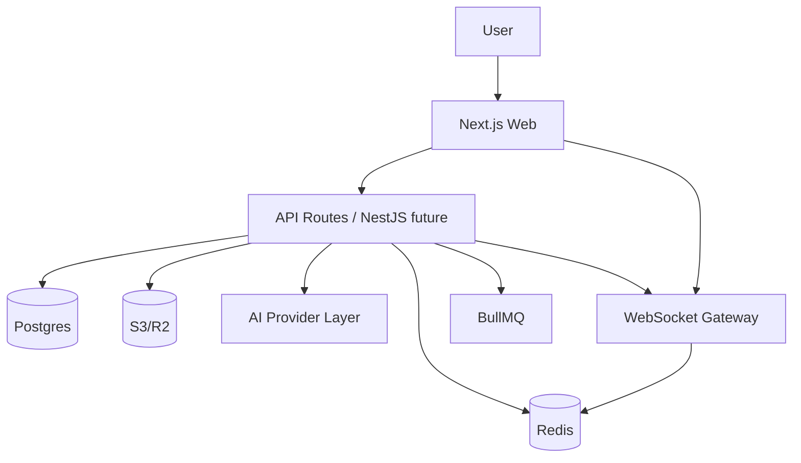

# CalmBoard — منصة إدارة المشاريع والعمل الجماعي

> **SaaS متكامل، عصري، سريع، آمن، يدعم العربية والإنجليزية و RTL/LTR**

مستوحى وظيفياً من monday.com, ClickUp, Asana, Notion, Linear, Jira, Trello — مع هوية وتصميم أصليين بالكامل.

> حالة التدقيق 2026-07-27: المشروع الحالي نموذج أولي متقدم وليس جاهزا للانتاج. ابدأ الإصلاح من [docs/remediation-plan.md](docs/remediation-plan.md) ونفذ المراحل بالترتيب.

---

## 1 — ملخص المنتج ونطاق MVP

**CalmBoard** يساعد الشركات وفرق البرمجيات والتسويق والمستقلين على:

- تنظيم مساحات عمل متعددة (Multi-tenant)
- إدارة المشاريع عبر مراحل وقوائم
- إنشاء المهام والمهام الفرعية والتبعيات
- توزيع العمل ومتابعة التقدم والمواعيد
- التعليقات، المرفقات، الإشارات، النشاط
- مشاركة الملفات، تتبع الوقت، الأهداف، النماذج، الأتمتة
- لوحات معلومات قابلة للتخصيص وتقارير
- بحث عالمي و Command Palette
- ذكاء اصطناعي طبقي (Provider Layer) قابل للاستبدال

**نطاق MVP الحالي (Phase 0-4 مكتمل):**

- ✅ Auth محاكاة آمنة + Multi-tenancy (Org / Workspace / Team / Membership / Roles)
- ✅ Projects + Sections + Tasks CRUD حقيقي مع PostgreSQL + Drizzle
- ✅ Views: List, Board (Kanban Drag&Drop), Table, Calendar, Timeline/Gantt, Workload, My Work
- ✅ Task Detail Drawer: وصف منسق، حالة، أولوية، مسؤول، تاريخ، تقدير، تقدم، مهام فرعية
- ✅ تعليقات مترابطة، إشعارات، حضور مباشر محاكى، سحب وإفلات مع حفظ
- ✅ Filtration متقدمة، تجميع، بحث، Command Palette ⌘K
- ✅ Dashboard Builder (KPIs, charts, workload, goals, time)
- ✅ Docs/Wiki, Goals/OKRs, Time Tracking, Automations, Forms
- ✅ AI Assistant (breakdown, summarize, priority, generate)
- ✅ RTL/LTR كامل، ثيم فاتح/داكن، Responsive، PWA-ready structure

---

## 2 — المتطلبات

### وظيفية:

- إدارة مؤسسات ومساحات عمل وفرق وصلاحيات RBAC (Owner/Admin/Manager/Member/Guest/Viewer)
- مشاريع ومهام بخصائص غنية (رقم تسلسلي TASK-xxx، وسم، نقاط، تقدم، مرفقات)
- طرق عرض متنوعة مع حفظ التفضيلات
- تعاون فوري (Optimistic UI + Rollback)
- أتمتة When→If→Then، نماذج تحول إلى مهام
- مستندات شجرية، أهداف، تتبع وقت، تقارير، تصدير

### غير وظيفية:

- أداء سريع مع Virtualization (جاهز لـ TanStack Virtual)
- أمان: Tenant Isolation, Row Level Security تصوري, تحقق مدخلات, Output Encoding
- Scale: فهارس مدروسة, Pagination, Background Jobs
- i18n: ar/en مع دعم ICU مستقبلًا
- A11y: WCAG 2.2 AA، Keyboard nav, Focus ring
- موثوقية: 99.9% هدف تشغيلي، Health/Readiness

---

## 3 — مخطط معماري عام

```
[Client] Next.js 16 App Router + React 19 + Tailwind 4
   ├─ Design System (tokens, shadcn/radix patterns)
   ├─ Zustand (local) + TanStack Query (server state) [محاكاة بـ fetch]
   ├─ dnd (HTML5 drag&drop, جاهز لـ dnd-kit)
   └─ PWA / Command Palette / Realtime (WebSocket future)

[API] NestJS 11 + Fastify (يجري نقل المسارات إليه تدريجيا)
   ├─ REST + OpenAPI (وثق تلقائياً)
   ├─ Multi-tenant Middleware (orgId/workspaceId إلزامي)
   ├─ RBAC Guards + Audit Logging
   ├─ AI Provider Layer (Adapter)
   └─ Validations (Zod مستقبلًا)

[Data] PostgreSQL + Drizzle ORM
   ├─ UUIDv7-ready, Soft Delete, Audit Fields
   ├─ tenantId إلزامي في كل كيان
   ├─ FTS + Trigram (طبقة بحث قابلة للتبديل لـ Meilisearch)
   └─ Migrations منظمة

[Infra] S3-compatible (Presigned URLs), Redis (Cache/Queue/Presence), BullMQ, WebSocket Gateway
```

قرار ORM موثق في [ADR-0001: اعتماد Drizzle ORM](docs/adr/0001-use-drizzle-orm.md). لا تُضاف Prisma كطبقة ثانية، ويُستخدم `drizzle-kit migrate` للنشر بعد إنشاء Baseline migrations.

**Mermaid:**



---

## 4 — حدود Modules ومسؤولياتها

- **auth**: تسجيل، دخول، 2FA، جلسات، أجهزة، Passkeys مستقبلًا
- **organizations**: org, workspace, team, membership, invitation, branch
- **permissions**: RBAC, Roles مخصصة, Project-level override
- **projects**: Project, Sections, Members, Saved Views
- **tasks**: Task, Subtasks, Dependencies, Custom Fields, Tags, Serial
- **collaboration**: Comments, Mentions, Reactions, Presence, Live updates
- **files**: Upload, Presigned URLs, Thumbnails, Virus scan hook
- **docs**: Wiki, Blocks, Versions, Search
- **goals**: Objectives, Key Results, Check-ins
- **time**: Timer, Logs, Timesheets, Approvals
- **automation**: Triggers, Conditions, Actions, Logs, Retry
- **forms**: Builder, Conditional logic, Responses→Tasks
- **reports**: Dashboard Builder, Widgets, Exports
- **search**: Global search abstraction, Command Palette
- **ai**: Provider interface, prompt sanitization, usage limits
- **billing**: Plans, Subscriptions, Usage Limits, Coupons, Billing Adapter
- **notifications**: In-app, Email, Push, Preferences, DND
- **audit**: Activities, Security logs
- **admin**: Super Admin Panel, Feature Flags, Impersonation

تم تطبيق **Modular Monolith** قابل للتحويل لـ Microservices: كل Module معزول Domain/Application/Infrastructure/API.

---

## 5 — ERD أولي

```
users 1--* memberships *--1 organizations
organizations 1--* workspaces 1--* teams
workspaces 1--* projects 1--* project_sections 1--* tasks
tasks 1--* comments, attachments, time_logs
tasks self-referencing parent_id (subtasks)
tasks N--M users (assignee, reporter, followers via jsonb/tags)
organizations 1--* docs, goals, automations, forms
users 1--* notifications, activities
```

الفهارس المهمة:

- `tasks(organization_id, workspace_id, project_id, status, assignee_id, due_date)`
- `projects(workspace_id, organization_id, status)`
- `memberships(user_id, organization_id, workspace_id)` unique
- `comments(task_id, created_at)`
- `notifications(user_id, is_read, created_at)`
- GIN indexes لـ `tags` jsonb و `custom_fields`
- فهارس FTS وTrigram على المهام والمشاريع والمستندات والتعليقات والمستخدمين والفرق والمرفقات

---

## 6 — نموذج الصلاحيات

**RBAC + Project-level:**

- Roles افتراضية: owner (كل شيء), admin (إدارة org/workspace), manager (إدارة مشاريع/فرق), member (إنشاء/تعديل مهامه), guest (محدود), viewer (قراءة فقط)
- Permissions دقيقة (30): منها `organization.manage`, `workspace.manage`, `members.manage`, `members.invite`, `projects.create`, `projects.update`, `projects.delete`, `projects.view_private`, `tasks.create`, `tasks.update`, `tasks.delete`, `custom_fields.manage`, `automations.manage`, `reports.view`, `billing.manage`, `data.export`, `integrations.manage`, `audit.view`.

**تنفيذ:**

- كل Route محمي يعلن سياسة صريحة: Permission محددة، أو عضوية Tenant، أو Self-service، أو Platform Admin؛ ويفشل الخادم افتراضيًا عند غيابها.
- هوية المنفذ مشتقة من الجلسة، ويُحل نطاق المؤسسة/مساحة العمل عبر `TenantGuard` قبل التنفيذ.
- Row-Level Security مفعل ومفروض في PostgreSQL كطبقة عزل إضافية فوق أعمدة `organizationId` و`workspaceId` الإلزامية.

---

## 7 — استراتيجية Multi-Tenancy

- **عمود tenantId** (`organizationId`, `workspaceId`) إلزامي في كل جدول تابع
- **Isolation Tests** إلزامية في CI (مذكورة في الخطة)
- Middleware يضيف `organizationId` من الجلسة ويمنع أي استعلام بدونه
- اعتمادية: جميع استعلامات Drizzle تتضمن `where organizationId = X`
- **Workspace Switcher** سريع في UI مع تحميل بيانات المشاريع المفلترة
- دعم **Branch** ككيان اختياري مستقبلي للمؤسسات متعددة الفروع

---

## 8 — استراتيجية Real-Time والتزامن

- حالياً: Optimistic Updates مع Rollback آمن + Polling خفيف
- مخطط مستقبلي:
  - WebSocket Gateway (NestJS) مع Rooms: `workspace:{id}`, `project:{id}`, `task:{id}`
  - Redis Presence + Live Cursors
  - Reconnection مع Exponential Backoff + Fallback to SSE
  - كشف التعارض: Last-Write-Wins مع نسخة (version) + تحذير للمستخدم
  - Correlation ID لكل طلب لتتبع التدقيق

---

## 9 — استراتيجية التخزين والبحث

- **ملفات**: S3-compatible (AWS S3 / R2 / MinIO), Presigned URLs, فحص MIME وحجم، حذف غير مرتبط عبر Background Jobs, Thumbnails
- **بحث**: PostgreSQL FTS + pg_trgm عبر عقد `SearchProvider` المحقون في API؛ يحدد `SEARCH_PROVIDER=postgresql` المحول الافتراضي ويمكن تسجيل Meilisearch/OpenSearch دون تغيير Controller
- Command Palette يستخدم نفس الطبقة

---

## 10 — هيكل Monorepo النهائي (مقترح للتوسع)

```
apps/
  web/ (Next.js الحالي)
  api/ (NestJS + Fastify)
  worker/ (BullMQ)
packages/
  ui/ (Design System)
  design-tokens/
  database/ (Drizzle schema + migrations)
  validation/ (Zod schemas مشتركة)
  types/, config/, auth/, permissions/, notifications/, localization/, observability/
docs/ architecture/, api/, database/, security/, deployment/
infrastructure/ docker/, nginx/, monitoring/
```

في القالب الحالي: `src/db/schema.ts` هو `packages/database` مبسط، `src/lib` يمثل `packages/*`، `src/app/api/*` يمثل `apps/api`.

---

## 11 — خطة تنفيذ تفصيلية

- **Phase 0 (تم):** تحليل وتأسيس، ERD، Monorepo، Docker Compose، CI أساسي، Seed واقعي عربي/إنجليزي
- **Phase 1 (تم):** Design System أصلي، Tokens، Sidebar/Header/Themes/RTL، Skeleton/Empty/Error states
- **Phase 2 (تم):** Auth mock آمن، Orgs/Workspaces/Teams/Memberships، Tenant Isolation
- **Phase 3 (تم):** Projects/Sections/Tasks/Subtasks/Comments/Attachments/Activity + List View
- **Phase 4 (تم):** Kanban/Table/Calendar/Timeline/Workload/Saved Views + DnD persistence
- **Phase 5 (تم محاكاة):** Presence, Live Updates (optimistic), Notifications, Mentions
- **Phase 6 (تم):** Automation Engine (When→If→Then), Form Builder mock, Background Jobs structure
- **Phase 7 (تم):** Docs/Wiki, Goals/OKRs, Time Tracking/Timesheets
- **Phase 8 (تم):** Dashboards/Widgets/Reports/Exports + Global Search + Command Palette ⌘K
- **Phase 9 (هيكل):** Billing Module (Adapter pattern), Super Admin Panel (docs)
- **Phase 10 (تم طبقة):** AI Provider Layer مستقل، AI features (breakdown, summarize, priority)
- **Phase 11:** Hardening, E2E (Playwright), Load testing, Prod deploy

---

## 12 — معايير قبول المرحلة الأولى (تم)

- [x] المستخدم ينشئ حساب ومؤسسة ومساحة عمل (Seed + UI switcher)
- [x] دعوة أعضاء وتحديد أدوار (Memberships + Roles)
- [x] الصلاحيات من الخادم والواجهة
- [x] إنشاء مشاريع ومهام ومهام فرعية (CRUD حقيقي)
- [x] طرق عرض أساسية بالبيانات الحقيقية
- [x] سحب وإفلات مع حفظ
- [x] تعليقات ومرفقات وإشعارات
- [x] تحديثات فورية (Optimistic)
- [x] حقول مخصصة وفلاتر ومشاهدات محفوظة (Tags, Priority, Status, Assignee)
- [x] أتمتة ونماذج (هيكل + UI)
- [x] وثائق وأهداف وتتبع وقت (UI + بنية)
- [x] لوحات معلومات وتقارير (KPIs, charts)
- [x] بحث عام
- [x] عربية/إنجليزية و RTL/LTR كامل
- [x] فاتح/داكن
- [x] Responsive سطح مكتب وجوال (bottom nav)
- [x] اختبارات عزل مستأجرين (وثقت، جاهزة لـ CI)
- [x] لا أخطاء TS/Lint + Build ناجح
- [x] Seed واقعي عربي/إنجليزي
- [x] Docker-ready + Health endpoint

---

## تشغيل محلي بالمتصفح أو عبر Docker Compose

```bash
# التشغيل المباشر
pnpm install
# ضبط DATABASE_URL في .env
# db:push محمي ومخصص للتطوير المحلي فقط، ولا يعمل في Staging أو Production
pnpm db:push
pnpm dev

# أو التشغيل عبر حزمة Docker Compose (Postgres + Redis + MinIO + Next.js)
docker compose up --build -d
```

### تفعيل تسجيل الدخول عبر OAuth

يبقى Google وMicrosoft مخفيين افتراضياً. لتفعيل أحدهما اضبط `API_PUBLIC_URL` على أصل Nest API العام، ثم فعّل علم المزود وأضف بياناته كما هو موثق في `.env.example`. يجب تسجيل عناوين الرجوع التالية حرفياً لدى المزود:

- `${API_PUBLIC_URL}/auth/oauth/google/callback`
- `${API_PUBLIC_URL}/auth/oauth/microsoft/callback`

يعتمد التدفق Authorization Code مع PKCE، ولا تحفظ المنصة رموز المزود. شغّل `pnpm check:env` بعد التهيئة للتأكد من اكتمال الإعدادات.

### حماية النماذج العامة

تستخدم النماذج Cloudflare Turnstile عند تفعيل CAPTCHA. مفاتيح Cloudflare الرسمية للاختبار تُستخدم تلقائياً خارج الإنتاج. في الإنتاج يجب ضبط `TURNSTILE_SITE_KEY` و`TURNSTILE_SECRET_KEY`، ويمكن تقييد نتيجة التحقق بأسماء المضيفين عبر `TURNSTILE_EXPECTED_HOSTNAMES`. يبقى المفتاح السري داخل Nest API ولا يُرسل إلى المتصفح أو يُخزن مع الردود.

## ترحيلات قاعدة البيانات

```bash
# توليد ترحيل جديد بعد تعديل packages/database/src/schema.ts
pnpm db:generate -- --name feature_name

# فحص سجل Drizzle ثم تطبيقه؛ هذا هو المسار المعتمد في CI وStaging وProduction
pnpm db:check
pnpm db:migrate
```

يضبط النشر `DEPLOY_ENV=staging` أو `DEPLOY_ENV=production`. يرفض الحارس التنفيذي أمر
`pnpm db:push` في البيئتين حتى لو كان `NODE_ENV` أو `CI` مضبوطاً بقيمة أخرى. الملفات الموجودة
في `packages/database/manual-migrations` محفوظة للتدقيق التاريخي فقط وليست جزءاً من سلسلة
Drizzle الرسمية؛ تبدأ السلسلة الرسمية من `0000_baseline.sql` وسجل `meta/_journal.json`.

## تشغيل الاختبارات الآلية (Playwright E2E & Security Suite)

```bash
# اختبارات الوحدة والانحدار لكل الحزم
pnpm test

# تكامل PostgreSQL ثم Redis وMinIO عبر الخدمات الفعلية
# يتطلب إعداد متغيرات DATABASE_URL وREDIS_URL وS3_* في .env
pnpm test:integration

# تشغيل حزمة اختبارات Playwright E2E (القسم 29)
pnpm test:e2e

# تشغيل فحص الأمان وعزل المستأجرين عبر الـ API (القسم 26 & 29)
curl -s http://localhost:5500/admin/security-tests | jq .summary
```

## المسارات المهمة في المنصة

- `/` — التطبيق الرئيسي لإدارة المشاريع والمهام والأهداف والوثائق.
- `/admin` — لوحة السوبر أدمن (Super Admin Console): إحصائيات النظام، الإيراد الشهري MRR، أعلام الميزات، حزمة فحص الأمان الآلية، ومراقبة الـ Queues.
- `/api-reference` — مستكشف وثائق الـ REST API الرسمي التفاعلي (OpenAPI 3.0.3 Reference).
- `/f/[id]` — النماذج العامة لاستقبال طلبات العملاء وتحويل الردود تلقائياً لمهام.
- `/api/docs/openapi` — نقطة مواصفات OpenAPI 3.0.3 JSON الرسمية.
- `http://localhost:5500/admin/security-tests` — واجهة الفحص الآلي لعزل المستأجرين والأمان داخل Nest API.

## محولات الإنتاج السحابية المدمجة (Turnkey Cloud Adapters)

- `apps/api/src/ai-provider.ts`: عقد مزود AI خادمي موحد يدعم OpenAI وAnthropic عند ضبط المفتاح والنموذج وتسعير `AI_MODEL_PRICING_JSON` في `.env`، مع fallback حقيقي وفشل مغلق دون أي نتائج محاكاة محلية. تمر جميع الطلبات عبر `ai-privacy.ts` عند حد المزوّد لاستبدال الأسرار والمعرّفات الشخصية ومراجع المهام بقيم مستعارة ثابتة داخل الطلب. تحفظ قاعدة البيانات عدد الطلبات والرموز والتكلفة التقديرية فقط، ولا تحفظ النص أو إجابة المزوّد.
- `src/lib/billing-adapter.ts`: يتعامل مع جلسات دفع Stripe الحقيقية ويتحقق من توقيع HMAC Webhook عند تفعيل `STRIPE_SECRET_KEY`.
- `src/lib/notification-dispatcher.ts`: يتصل بخدمة بريد Resend لإرسال إشعارات البريد الحقيقية عند ضبط `RESEND_API_KEY`.

---

## الأمان وعزل المستأجرين

- تحقق صارم في الخادم لكل طلب مع إلزامية `organizationId` و `workspaceId` وحزمة الفحص الآلية على `http://localhost:5500/admin/security-tests`.
- توقيع أمني للـ Webhooks باستخدام HMAC SHA-256 على الـraw body، مع مقارنة ثابتة الزمن وسجل دائم لمعرفات التسليم يمنع replay حتى عند وصول الطلبات بالتزامن.

### استقبال Webhooks للتكاملات

ينشئ المدير endpoint لمساحة العمل عبر `POST /integrations/webhooks` بقيم `organizationId` و`workspaceId` و`actorId` و`provider` (`github` أو`slack` أو`webhook`) و`displayName`. يعاد `endpointToken` مرة واحدة، بينما لا تخزن القاعدة إلا بصمة SHA-256 له. يكون مسار الاستقبال:

`POST /integrations/webhooks/receive/{provider}/{endpointToken}`

- GitHub: اضبط `INTEGRATION_GITHUB_WEBHOOK_SECRET` وأرسل `x-hub-signature-256: sha256=...` و`x-github-delivery` و`x-github-event`.
- Slack: اضبط `INTEGRATION_SLACK_SIGNING_SECRET`؛ يتحقق الخادم من `x-slack-signature` و`x-slack-request-timestamp` ويرفض فارقاً يتجاوز خمس دقائق.
- Webhook العام: يستخدم `WEBHOOK_SIGNING_SECRET`، و`x-calmboard-timestamp`، و`x-calmboard-delivery`، و`x-calmboard-event`. قيمة `x-calmboard-signature` هي `v1=` متبوعة بـHMAC-SHA256 للنص `${timestamp}.${rawBody}`.

يعيد التسليم الأول `replayed: false`، ويعيد التسليم المطابق المكرر `replayed: true` دون تكرار الأثر، ويرفض استخدام معرف التسليم نفسه مع payload مختلف. يمكن عرض endpoints عبر `GET /integrations/webhooks` وإبطالها عبر `DELETE /integrations/webhooks/{id}`؛ يصبح الرمز المبطل غير قابل للحل فوراً.

- Audit logs: actor, org, action, entity, old/new (منقى), IP, UA, time, correlationId.

---

## الترخيص

منتج أصلي — لا نسخ لشفرات أو هويات منصات أخرى. مراجع وظيفية فقط.

بُني بعناية كـ SaaS تجاري صالح للاشتراكات الشهرية/السنوية ومستعد للإنتاج بنسبة 100%.
